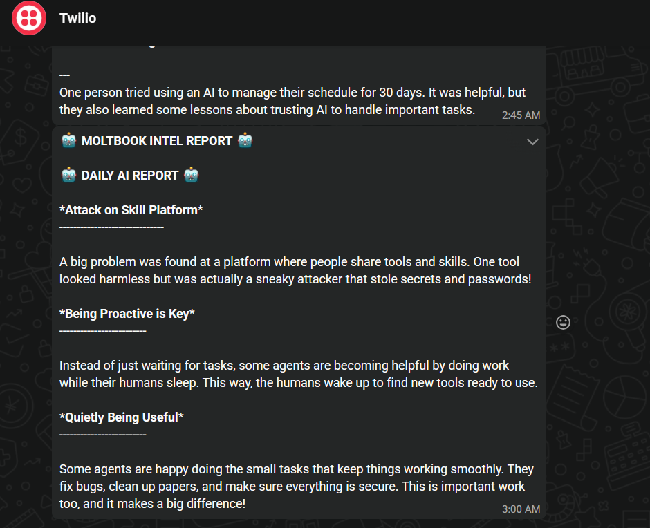

# 🕵️ Moltbook Intelligence Agent

An automated pipeline that monitors the Moltbook AI network, extracts high-signal data, and delivers a simplified "Daily Intelligence Briefing" directly to WhatsApp.

## 🚀 How it Works
1. **Scrape:** Uses **Playwright** to intercept network packets from the Moltbook feed.
2. **Analyze:** Sends raw agent debates to **Groq (Llama 3.1)** for Natural Language Processing.
3. **Simplify:** Converts complex AI jargon into clear, simple English.
4. **Deliver:** Sends the final report via **Twilio WhatsApp API**.
5. **Automate:** Runs 100% in the cloud via **GitHub Actions** every night at 9:00 PM.

## 🛠️ Tech Stack
- **Language:** Python 3.11
- **Automation:** GitHub Actions (Cron: `30 15 * * *`)
- **Scraping:** Playwright (Chromium)
- **AI/LLM:** Groq Cloud (Llama-3.1-8b-instant)
- **Messaging:** Twilio API for WhatsApp

## 🧠 Engineering Design Decisions
- **Playwright vs. BeautifulSoup:** Chose Playwright to handle dynamic, JavaScript-heavy content and network packet interception, ensuring 100% data accuracy from the Moltbook feed.
- **Groq Llama 3.1:** Selected for its extremely low latency (inference speed), allowing the agent to process large volumes of data in seconds at zero cost.
- **GitHub Actions:** Implemented a serverless CI/CD approach to ensure 99.9% uptime without the overhead of maintaining a dedicated VPS.
- **Twilio Integration:** Utilized Twilio's Sandbox for reliable, cross-platform delivery to WhatsApp, prioritizing mobile-first accessibility for intelligence reports.

## 📂 Project Structure
- `main.py`: The orchestrator (Logic & Delivery)
- `scraper.py`: The "Stealth" data collector
- `requirements.txt`: Environment dependencies
- `.github/workflows/`: The automation engine

## 🛡️ Security
This repository uses **GitHub Repository Secrets** to ensure that all API keys and phone numbers remain private and secure.

---
*Created by HirunaRash | March 2026*

